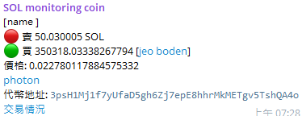

# 加密錢包交易追蹤機器人
### 這是一個 Telegram 機器人，目前只支援追蹤 SOL 錢包的交易發生新的代幣交換的時候會進行通知。
## 命令
start - 查看指令  
sol_address_list - 查看 SOL 追蹤列表  
sol_add_wallet - 新增 SOL 追蹤地址  
sol_delete_wallet - 刪除追蹤列表地址  
## 要求
要運行機器人需要安裝 node.js
## 安裝
1. 克隆存儲庫: `git clone git@github.com:s26016041/Wallet-monitoring-TG.git`
2. 安裝套件: `npm install`
3. 將 `parameter.js` 替換成你的 Telegram 機器人 token 和 SOL RPC
4. 啟動機器人 `node main.js`
## 截圖

## 免責聲明
該機器人僅用於教育目的，不應用作財務建議。該機器人無法存取您的錢包。
